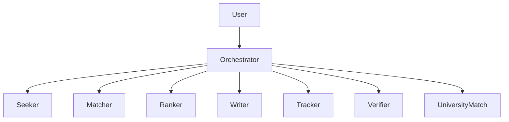

# ResearchScholar AI  
**An Autonomous Scholarship Research Lab Built with ConnectOnion**

[](https://opensource.org/licenses/MIT)


> **Find. Match. Apply. Win.**  
> Your 24/7 AI-powered scholarship co-pilot — built for students, by AI.

---

## Overview

**ResearchScholar** is a **multi-agent AI system** built using the **[ConnectOnion framework](https://docs.connectonion.com)** that automates the entire scholarship application lifecycle:

1. **Discovers** global scholarships from 1000+ sources  
2. **Matches** them to your academic & personal profile  
3. **Ranks** by success probability and effort/reward  
4. **Writes** tailored essays, CV mappings, and LOR prompts  
5. **Tracks** deadlines and application status  

No more endless searching. Just results.

---

## Architecture (Multi-Agent Swarm)

### Agent Hierarchy
```
User
  ↓
Orchestrator (Central Coordinator)
  ├── Seeker (Scholarship Discovery)
  ├── Matcher (Eligibility Matching)
  ├── Ranker (Priority Scoring)
  ├── Writer (Application Materials)
  ├── Tracker (Deadline Management)
  ├── UniversityMatch (Inclusive University Recs)
  └── Verifier (Quality Assurance)
```



### Agent Descriptions

**Orchestrator**
- Central coordinator managing all agents
- Routes requests and aggregates results
- Maintains conversation state
- Handles error recovery

**Seeker**
- Searches scholarship databases and APIs
- Web scraping from university sites
- Monitors new opportunities
- Data sources: Fastweb, Scholarships.com, College Board

**Matcher**
- Compares student profile with eligibility criteria
- Filters by GPA, major, demographics, location
- Applies rule-based matching logic
- Reads from student profile database

**Ranker**
- Calculates fit scores (0-100%)
- Estimates success probability
- Considers award amount vs application effort (ROI)
- Uses ML models for prediction

**Writer**
- Generates personalized essay drafts
- Creates CV bullet points
- Suggests letter of recommendation prompts
- Uses templates and student experiences

**Tracker**
- Monitors application deadlines
- Sends timely reminders
- Tracks submission status
- Calendar integration

**Verifier**
- Validates application completeness
- Checks requirement fulfillment
- Quality assurance before submission
- Ensures no missing documents

**UniversityMatch**
- Uses demographics, location, and interests to suggest inclusive programs
- Highlights tuition support and mentoring ecosystems
- Surfaces fit reasons (location match, demographic focus, major coverage)

### Data Flow
```
User Query
    ↓
Orchestrator receives request
    ↓
Orchestrator → Seeker → [Scholarship APIs + Web Sources]
    ↓
Seeker returns scholarship list
    ↓
Orchestrator → Matcher → [Student Profile DB + Rules Engine]
    ↓
Matcher returns eligible scholarships
    ↓
Orchestrator → Ranker → [ML Scoring Model]
    ↓
Ranker returns prioritized list
    ↓
Orchestrator → User with ranked results
```

---

## Quick Start

1. **Install dependencies**
   ```bash
   cd /home/martin/agent_ConnectOnion_application
   python -m venv .venv && source .venv/bin/activate
   pip install -r requirements.txt
   ```
2. **Configure API keys**
   - Copy `.env.example` to `.env` inside `my-agent/` (or create it manually).
   - Add either `OPENONION_API_KEY=co/XXXX` or your `OPENAI_API_KEY=sk-XXXX`.
3. **Run the ResearchScholar agent**
   ```bash
   cd my-agent
   python agent.py \
     --profile profiles/sample_profile.json \
     --query "scholarships for women in computer science building social impact startups"
   ```
4. **Optional**: save structured output
   ```bash
   python agent.py --output report.json
   ```

### CV Parser Agent

Convert an existing CV/resume PDF into a normalized profile JSON before running the rest of the swarm.

```bash
cd /home/martin/agent_ConnectOnion_application/my-agent
python parsing_cv.py \
  --pdf /absolute/path/to/cv.pdf \
  --output profiles/generated_profile.json \
  --model co/gpt-4o-mini
```

This script:
1. Extracts raw text from the PDF.
2. Calls the `llm_do()` helper from ConnectOnion for structured field extraction.
3. Persists the resulting JSON so downstream agents (Matcher, Ranker, Writer, UniversityMatch, etc.) can reuse it.

### University Match Recommender

Once you have a student profile (from `parsing_cv.py` or manual JSON), run the main pipeline via `agent.py`. The orchestrator now appends `universities.recommendations` to the final report, which lists the top inclusive programs plus the reasoning for each match. Example snippet:

```json
"universities": {
  "recommendations": [
    {
      "university": { "name": "Aurora Institute of Technology", "...": "..." },
      "score": 90,
      "fit_reasons": [
        "Location alignment",
        "Demographic programs for women, first-generation",
        "Major available with targeted support"
      ]
    }
  ]
}
```

Use these outputs to prioritize direct outreach to partner universities or to inform scholarship targeting.

### Web Dashboard (React)

Visualize any `report.json` (from `agent.py --output`) with a lightweight React dashboard.

```bash
cd /home/martin/agent_ConnectOnion_application/frontend
npm install          # first run only
npm run dev          # http://localhost:5173
```

Features:
- Upload your generated JSON or load the bundled sample to preview the UI.
- View profile summary, ranked scholarships, university matches, and milestone notifications.
- Upcoming deadlines (<=10 days) surface as alert cards so you can act before submissions close.

---

## Repository Layout

```
agent_ConnectOnion_application/
├── README.md               # Product brief & architecture
├── requirements.txt        # Python dependencies
├── my-agent/               # ConnectOnion implementation
│   ├── agent.py            # CLI entry point
│   ├── profiles/           # Sample student profiles
│   └── research_scholar/   # Core package (models, tools, orchestrator)
└── tests/                  # Pytest suite validating the pipeline
```

---

## Feature Coverage vs README

| Requirement                               | Implementation Detail                              |
|-------------------------------------------|----------------------------------------------------|
| Multi-agent swarm (Seeker→Verifier)       | `research_scholar.tools` + `research_scholar.agents`|
| Orchestrator that routes between agents   | `ResearchScholarOrchestrator.run()`                |
| Scholarship discovery & matching pipeline | `seeker_search_tool`, `matcher_filter_tool`        |
| Ranking by probability & effort           | `ranker_score_tool` scoring heuristic              |
| Application material drafting             | `writer_materials_tool`                            |
| Deadline tracking & reminders             | `tracker_schedule_tool`                            |
| QA / completeness verification            | `verifier_checklist_tool`                          |
| Inclusive university matching             | `university_match_tool`                            |

---

## Testing

Run the automated checks anytime you modify the pipeline:

```bash
pytest
```

The suite validates that every stage (Seeker→Verifier) returns structured data for the provided reference profile.

---

## Extending the System

- **Swap in real data sources**: Implement adapters in `research_scholar/data.py` that fetch from APIs (Fastweb, College Board, etc.) and inject them into the seeker tool.
- **Plug in ML rankers**: Replace `ranker_score_tool` with a model-backed scoring service; expose weight overrides via CLI flags.
- **Calendar/webhook integration**: Extend `tracker_schedule_tool` to push reminders to Google Calendar, Slack, or email.
- **Conversation layer**: Use the instantiated ConnectOnion `Agent` objects in `research_scholar/agents.py` to hold stateful chats with students for profile enrichment.

---
