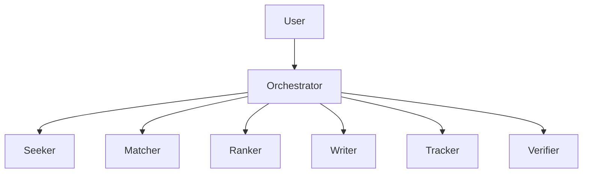

# ResearchScholar AI  
**An Autonomous Scholarship Research Lab Built with ConnectOnion**

[](https://opensource.org/licenses/MIT)


> **Find. Match. Apply. Win.**  
> Your 24/7 AI-powered scholarship co-pilot — built for students, by AI.

---

## Overview

**ResearchScholar** is a **multi-agent AI system** built using the **[ConnectOnion framework](https://docs.connectonion.com)** that automates the entire scholarship application lifecycle:

1. **Discovers** global scholarships from 1000+ sources  
2. **Matches** them to your academic & personal profile  
3. **Ranks** by success probability and effort/reward  
4. **Writes** tailored essays, CV mappings, and LOR prompts  
5. **Tracks** deadlines and application status  

No more endless searching. Just results.

---

## Architecture (Multi-Agent Swarm)

### Agent Hierarchy
```
User
  ↓
Orchestrator (Central Coordinator)
  ├── Seeker (Scholarship Discovery)
  ├── Matcher (Eligibility Matching)
  ├── Ranker (Priority Scoring)
  ├── Writer (Application Materials)
  ├── Tracker (Deadline Management)
  └── Verifier (Quality Assurance)
```



### Agent Descriptions

**Orchestrator**
- Central coordinator managing all agents
- Routes requests and aggregates results
- Maintains conversation state
- Handles error recovery

**Seeker**
- Searches scholarship databases and APIs
- Web scraping from university sites
- Monitors new opportunities
- Data sources: Fastweb, Scholarships.com, College Board

**Matcher**
- Compares student profile with eligibility criteria
- Filters by GPA, major, demographics, location
- Applies rule-based matching logic
- Reads from student profile database

**Ranker**
- Calculates fit scores (0-100%)
- Estimates success probability
- Considers award amount vs application effort (ROI)
- Uses ML models for prediction

**Writer**
- Generates personalized essay drafts
- Creates CV bullet points
- Suggests letter of recommendation prompts
- Uses templates and student experiences

**Tracker**
- Monitors application deadlines
- Sends timely reminders
- Tracks submission status
- Calendar integration

**Verifier**
- Validates application completeness
- Checks requirement fulfillment
- Quality assurance before submission
- Ensures no missing documents

### Data Flow
```
User Query
    ↓
Orchestrator receives request
    ↓
Orchestrator → Seeker → [Scholarship APIs + Web Sources]
    ↓
Seeker returns scholarship list
    ↓
Orchestrator → Matcher → [Student Profile DB + Rules Engine]
    ↓
Matcher returns eligible scholarships
    ↓
Orchestrator → Ranker → [ML Scoring Model]
    ↓
Ranker returns prioritized list
    ↓
Orchestrator → User with ranked results
```

---
